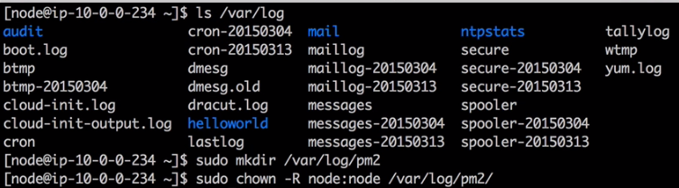

#PM2
##Using PM2 To Keep Your Node Apps Alive
**PM2** is a production process manager for Node.js applications with a built-in **load balancer**. It allows you to keep applications alive forever, to reload them without downtime and to facilitate common system admin tasks.

#####Install:

	npm install -g pm2
	
#####Before start
PM2 can generate and configure a startup script to keep PM2 and your processes alive at every server restart.

```
$ pm2 startup
# auto-detect platform
$ pm2 startup [platform]
# render startup-script for a specific platform, the [platform] could be one of:
#   ubuntu|centos|redhat|gentoo|systemd|darwin|amazon
```

#####Start:

	pm2 start bin/www
	


This has the same effect as:

     node bin/www

run the app, but on windows, it just keep it run once, once you refresh the page, the app die. [**PROBLEM**]

If it works as expected, when you kill the process:

	kill -9 <pid>
	
The pm2 will detect that our app is crashed, so it will start a new pid to run the app.

[Notice:] On Linux, PM2 will grap the root, run as root, but in genral, we don't want to use root. So we usually create a user to use PM2.
pm2 startup on liunx:


Change the user:


test script:


	
More  information:

* [egghead](https://egghead.io/lessons/node-js-using-pm2-to-keep-your-node-apps-alive)
* [Github](https://github.com/Unitech/pm2)


##Configuring PM2 for Node applications
In this lesson, you will learn how to configure node apps using pm2 and a json config file.
Let's say there are tow node apps: app1, app2.

What we want to do is create a json fie as config file for pm2.

pm2.config.json:

```
{
  "apps": [{
    "name": "App1",
    "script": "app1/server.js"
  },{
    "name": "App2",
    "script": "app2/server.js"
  }]
}
```

app1/server.js:
```
var http = require("http");
var server = http.createServer(function(request, response){
    response.writeHead('200', {"Content-Type": "text/plain"});
    response.end("Hello from app1");
});
server.listen(3000);
console.log("Listen on port 3000");
```

app2/server.js:
```
var http = require("http");
var server = http.createServer(function(request, response){
    response.writeHead('200', {"Content-Type": "text/plain"});
    response.end("Hello from app2");
});
server.listen(3001);
console.log("Listen on port 3001");
```

#####Usage:
	
	pm2 start pm2.comfing.json


More:
* [egghead](https://egghead.io/lessons/node-js-using-pm2-to-keep-your-node-apps-alive)
* [Github](https://github.com/eggheadio/simple_server)


## Loggin with PM2
Add config for app's log and error log for PM2.
```
{
  "apps": [{
    "name": "App1",
    "script": "app1/server.js",
    "log_file": "log/app1.log",
    "error_file": "log/app1-err.log"
  },{
    "name": "App2",
    "script": "app2/server.js",
    "log_file": "log/app2.log",
    "error_file": "log/app2-err.log"
  }]
}
```

If on Linux & Mac, you might want to enable 'node' user's permission for writing logs.

